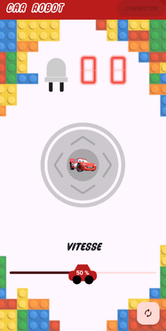

# Car Robot control

The flutter mobile application allows to control a car robot via BLE.

## Getting Started

This project is a starting point for a Flutter application.

A few resources to get you started if this is your first Flutter project:

- [Lab: Write your first Flutter app](https://docs.flutter.dev/get-started/codelab)
- [Cookbook: Useful Flutter samples](https://docs.flutter.dev/cookbook)

For help getting started with Flutter development, view the
[online documentation](https://docs.flutter.dev/), which offers tutorials,
samples, guidance on mobile development, and a full API reference.

## Packages prerequisites

## Features

 
*The app rendering*

### Connect button

Connect to the BLE device, once it has  been detected.
### LED button
Switch on/off on-board LED, as well as robot's notifications.

### Digital LCD
Display received notifications for robot ble device.

### Joystick
Controls the motion of the car.

- On drag: Move (up, down, right, left)
- On released: Stop

### Slider
Controls the speed of the car.

- On drag: Update speed value
- On released: Send speed value

*Note: The percentage value is just for display, the value that is sent is the real 8-bits PWM value.*

### Refresh button

Restart BLE scanning. Can be useful if the device was not detected (i.e. the connect button isn't active).
